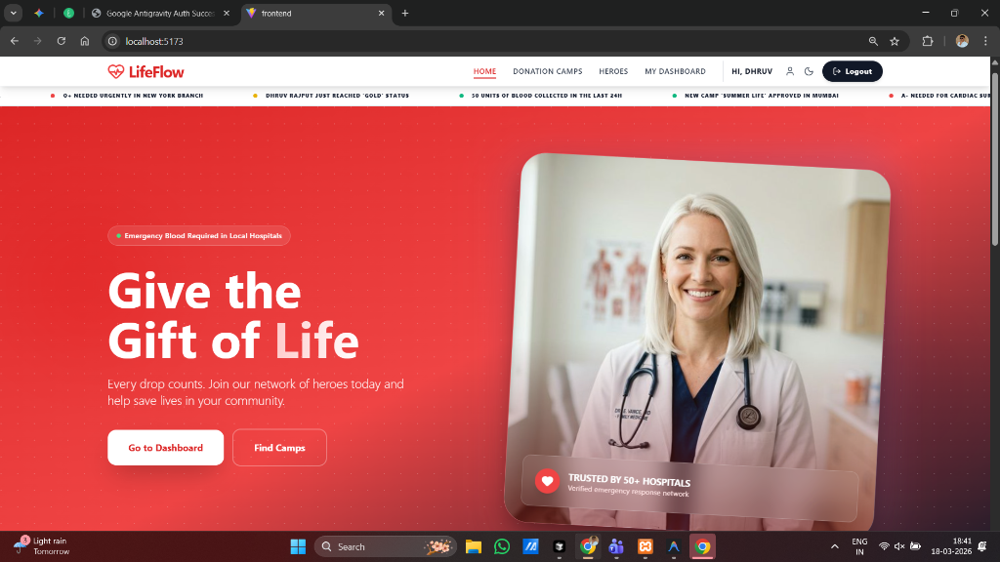
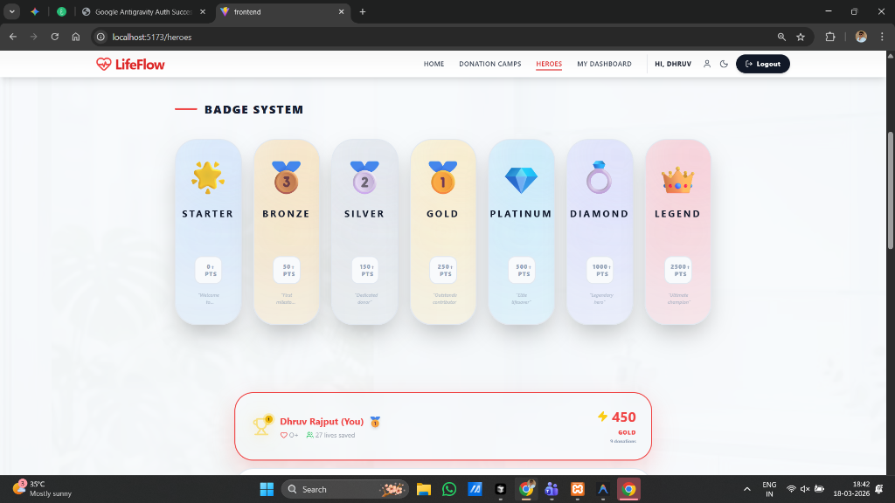
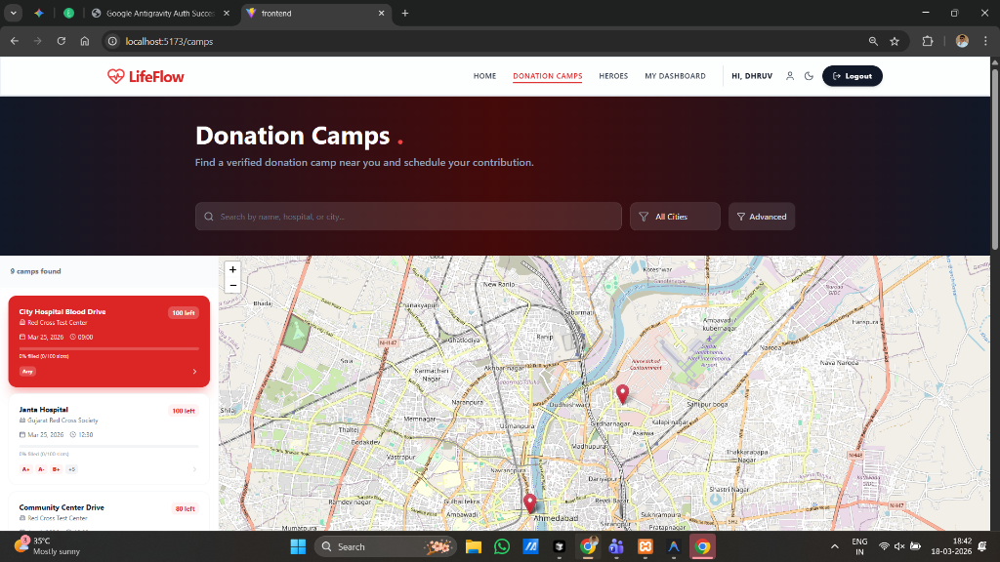
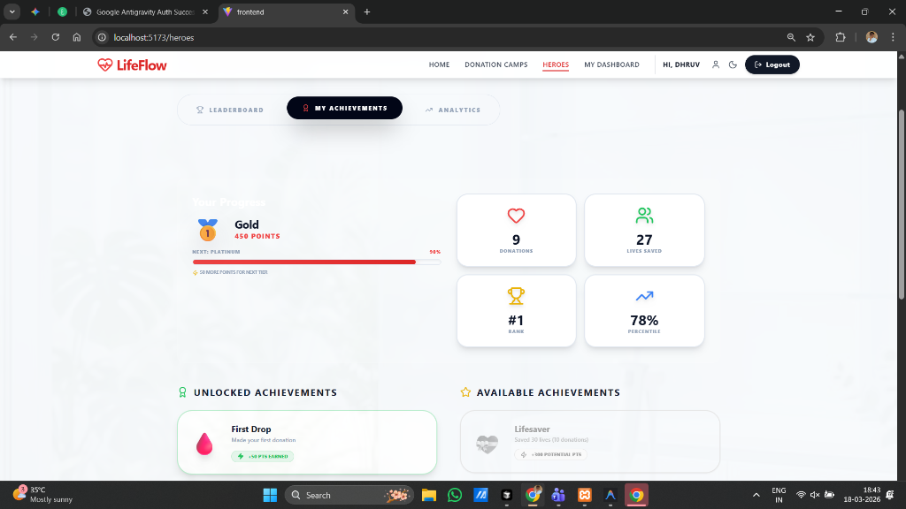

# LifeFlow Modern - Blood Donation Management System

## 📸 **Application Showcase**

<div align="center">
  
  
</div>
<div align="center">
  
  
</div>

## 🚀 **Enhanced Features Added**

### ✅ **Core Features**
1. **Interactive Maps** - Leaflet-based map with camp locations
2. **Appointment Scheduling** - Time slot booking system
3. **Gamification & Leaderboards** - Points, badges, and top donors
4. **Auto-Matching Algorithm** - Smart donor matching for emergencies
5. **AI Chatbot** - Medical assistant with 4 specialized modes

### 🔒 **Security Enhancements**
- **Enhanced JWT Authentication** with token validation
- **Rate Limiting** - 100 requests per 15 minutes per IP
- **Helmet.js** for security headers
- **Input Validation** and sanitization
- **Password Strength** requirements (8+ characters)

### ⚡ **Performance Optimizations**
- **Database Connection Pooling** (max: 20, min: 5 connections)
- **Response Caching** for public endpoints
- **Compression** middleware for faster responses
- **Request Retry Logic** for failed connections
- **Health Check** endpoints

### 🤖 **AI Chatbot Modes**
1. **Medical Screening Assistant** - Pre-donation eligibility check
2. **Expert Hematologist** - Blood type compatibility explanations
3. **Recovery Room Nurse** - Post-donation care advice
4. **Emergency Analyzer** - Urgent request analysis

## 🏗️ **Project Structure**

```
lifeflow-modern/
├── backend/
│   ├── config/
│   │   └── db.js              # Database models & relationships
│   ├── middleware/
│   │   ├── authMiddleware.js  # Enhanced JWT authentication
│   │   └── cache.js          # Caching & rate limiting
│   ├── routes/
│   │   ├── auth.js           # Authentication endpoints
│   │   ├── appointments.js   # Appointment booking
│   │   ├── leaderboard.js    # Gamification & badges
│   │   ├── matching.js       # Auto-matching algorithm
│   │   └── chatbot.js        # AI chatbot endpoints
│   └── index.js              # Main server with security
├── frontend/
│   ├── src/
│   │   ├── components/
│   │   │   ├── ChatBot.jsx   # AI chatbot interface
│   │   │   └── AppointmentBooking.jsx
│   │   ├── pages/
│   │   │   ├── Heroes.jsx    # Leaderboard page
│   │   │   └── DonationCamps.jsx
│   │   ├── context/
│   │   │   └── authStore.js  # Enhanced auth state
│   │   └── lib/
│   │       └── api.js        # API client with retry logic
│   └── App.jsx               # Main app with auth redirects
└── README.md
```

## 🚦 **Quick Start**

### **1. Start Backend Server**
```bash
cd lifeflow-modern/backend
npm install
npm start
```
**Backend URL:** `http://localhost:5000`

### **2. Start Frontend Server**
```bash
cd lifeflow-modern/frontend
npm install
npm run dev
```
**Frontend URL:** `http://localhost:5173`

## 🔐 **Default Login Credentials**

### **Admin**
- Email: `admin@lifeflow.com`
- Password: `admin123`
- URL: `http://localhost:5173/admin-dashboard`

### **Organization**
- Email: `org@lifeflow.com`
- Password: `org123`
- URL: `http://localhost:5173/org-dashboard`

### **Donor**
- Register new account at `http://localhost:5173/register`
- URL: `http://localhost:5173/dashboard`

## 📊 **Database Models**

### **User Model**
- Basic info + blood type + location
- Role-based access (ADMIN, ORGANIZATION, DONOR)
- Gamification fields (points, badges)

### **Camp Model**
- Donation camp details with geolocation
- Time slots and capacity management
- Approval workflow

### **Appointment Model**
- Time slot bookings
- Status tracking (SCHEDULED, COMPLETED, CANCELLED)
- Integration with donations

### **Notification Model**
- Urgent request alerts
- System notifications
- Read status tracking

## 🔧 **Environment Variables**

Create `.env` file in `backend/`:
```env
PORT=5000
JWT_SECRET=your-super-secret-jwt-key-change-in-production
JWT_EXPIRES_IN=7d
DB_HOST=localhost
DB_USER=root
DB_PASS=
DB_NAME=lifeflow
NODE_ENV=development
FRONTEND_URL=http://localhost:5173
```

## 🎯 **Key API Endpoints**

### **Authentication**
- `POST /api/auth/register` - User registration
- `POST /api/auth/login` - User login
- `POST /api/auth/logout` - User logout

### **Appointments**
- `GET /api/appointments/camps/:campId/slots` - Available time slots
- `POST /api/appointments/book` - Book appointment
- `GET /api/appointments/my` - User's appointments

### **Leaderboard**
- `GET /api/leaderboard/top-donors` - Top donors
- `GET /api/leaderboard/badges` - Badge system info

### **AI Chatbot**
- `POST /api/chatbot/chat` - AI assistant with mode selection

### **Auto-Matching**
- `POST /api/matching/auto-match/:requestId` - Match donors to emergency

## 🛡️ **Security Features**

1. **JWT Token Validation** - Token expiration and validation
2. **Rate Limiting** - Prevents brute force attacks
3. **CORS Configuration** - Restricts cross-origin requests
4. **Input Sanitization** - Prevents injection attacks
5. **Password Hashing** - bcrypt with 12 rounds
6. **HTTP Security Headers** - Helmet.js protection

## 📈 **Performance Features**

1. **Connection Pooling** - Manages database connections efficiently
2. **Response Caching** - Reduces database load
3. **Request Compression** - Faster network transfer
4. **Retry Logic** - Handles transient failures
5. **Health Monitoring** - System status checks

## 🤖 **AI Chatbot Usage**

The chatbot has 4 specialized modes:

1. **Medical Screening** - Check donation eligibility
   - Age (18+), weight (50kg+), recent tattoos, medications

2. **Blood Compatibility** - Explain blood types
   - Universal donor (O-), universal recipient (AB+)
   - Compatibility charts

3. **Recovery Advice** - Post-donation care
   - Hydration, rest, bandage care
   - Dizziness management

4. **Emergency Analysis** - Analyze urgent requests
   - Extract hospital, blood type, units
   - Determine urgency level

## 🚨 **Emergency Features**

### **Auto-Matching Algorithm**
- Finds compatible donors by blood type and location
- Checks donation eligibility (56-day rule)
- Sends urgent notifications to matched donors

### **Notification System**
- Real-time alerts for urgent requests
- Dashboard notifications
- Email/SMS integration ready

## 🎮 **Gamification System**

### **Points System**
- +50 points per completed donation
- Badge progression:
  - Starter (0 points)
  - Bronze (100 points) 🥉
  - Silver (250 points) 🥈
  - Gold (500 points) 🥇
  - Hero (1000 points) 🦸

### **Leaderboard**
- Top donors ranking
- Monthly and all-time leaderboards
- Public "Heroes" page

## 🔄 **Workflow**

1. **User Registration** → Role-based dashboard
2. **Camp Discovery** → Interactive map with pins
3. **Appointment Booking** → Time slot selection
4. **Donation** → Admin approval → Points awarded
5. **Leaderboard** → Recognition and badges
6. **Emergency** → Auto-matching → Notifications

## 🚧 **Troubleshooting**

### **Database Connection Issues**
1. Check MySQL is running
2. Verify credentials in `.env`
3. Run `npm run seed` to create test data

### **JWT Token Issues**
1. Clear browser localStorage
2. Check token expiration
3. Verify JWT_SECRET in `.env`

### **CORS Errors**
1. Verify FRONTEND_URL in `.env`
2. Check browser console for errors
3. Ensure ports match (5000 backend, 5173 frontend)

## 📞 **Support**

For issues or feature requests:
1. Check server logs for errors
2. Verify database connectivity
3. Test API endpoints with Postman
4. Review browser console errors

## 🎉 **Ready for Production**

The system includes:
- ✅ Security hardening
- ✅ Performance optimization
- ✅ Error handling
- ✅ Monitoring endpoints
- ✅ Graceful shutdown
- ✅ Database connection management

**Next Steps for Production:**
1. Set up SSL certificates
2. Configure Redis for caching
3. Add email/SMS notifications
4. Implement load balancing
5. Set up monitoring (Prometheus/Grafana)

---

**LifeFlow Modern** - Saving lives with technology! 🩸💻